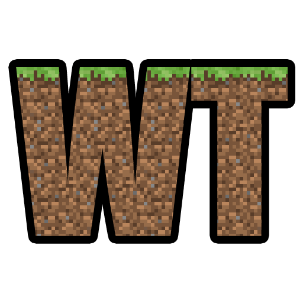

  

# WorldTools: World Downloader (Fabric / Forge)

WorldTools is a powerful Minecraft 1.20.1 Mod that allows you to capture and save high-detail snapshots of server worlds
locally.
It empowers you to download comprehensive information, including chunks, entities,
chests, players, statistics, advancements, and detailed metadata.
WorldTools ensures that you can retain an accurate and unaltered representation of the server's world for analysis,
sharing, or backup purposes on your local machine.

  
  

  

## Features

- **Comprehensive Data Capture**: WorldTools enables you to capture various critical aspects, preventing any detail from
  being overlooked.
    - Chunks: Terrain and structures
    - Entities: Positions and attributes of all entities
    - Containers: Contents of chests, hoppers etc.
    - Players: Player positions and inventories
    - Statistics: Full personal player statistics
    - Advancements: Player advancements and progress
    - Detailed Metadata: Exhaustive capture details

- **Capture Mode**: Enable capture mode to continuously cache loaded chunks and entities from the server. The data is
  periodically saved to your local disk, ensuring you don't lose any valuable information.

- **Configurable Options**:
    - Access the menu by pressing `F12` (changeable in the controls screen), providing numerous options (work in
      progress) to customize WorldTools according to your requirements.

- **Freeze Entities**: This option freezes all entities, preventing them from moving upon login.

- **Freeze World**: Stop new chunks from generating using a custom world generator, freeze time and weather, and set
  other gamerules to ensure a non-altered snapshot of the world.

- **Easy Access to Saved Worlds**: Your locally captured world save can be found in the single-player worlds list,
  allowing you to load and explore it conveniently.

## Getting Started

### Fabric

  
  

1. **Installation**:
    - Install Fabric by following the [Fabric Installation Guide](https://fabricmc.net/wiki/install).
    - Download the latest Fabric version of WorldTools from
      the [releases page](https://github.com/Avanatiker/WorldTools/releases)
    - Place the WorldTools Fabric mod JAR file in the "mods" folder of your Fabric installation.

2. **Prerequisites**: Make sure you have the following mods installed:
    - [Fabric API](https://www.curseforge.com/minecraft/mc-mods/fabric-api)
    - [fabric-language-kotlin](https://www.curseforge.com/minecraft/mc-mods/fabric-language-kotlin)

### Forge

1. **Installation**:
    - Install Forge by following the [Forge Download Link](https://files.minecraftforge.net/net/minecraftforge/forge/).
    - Download the latest Forge version of WorldTools from
      the [releases page](https://github.com/Avanatiker/WorldTools/releases)
    - Place the WorldTools Forge mod JAR file in the "mods" folder of your Forge installation.

2. **Prerequisites**: Make sure you have the following mods installed:
    - [Kotlin For Forge](https://www.curseforge.com/minecraft/mc-mods/kotlin-for-forge)

### Usage

1. **Commands**:
    - Enable capture mode: Use `/worldtools capture start` to start capturing data.
    - Play the game normally while WorldTools caches the necessary data.
    - Save captured data: Trigger `/worldtools save` to save the cached data to disk.
    - Disable capture mode: Use `/worldtools capture stop` to stop capturing data.

2. **Access Configuration Menu**: Press `F12` to access the configuration menu and explore available options (work in
   progress).

### File Structure

After capturing data, WorldTools creates the following files in the world directory's folder:

- `Capture Metadata.md`: Contains detailed information about the capture process itself.

- `Dimension Tree.txt`: Provides a tree of all dimension folder paths of the server, not just the downloaded ones.

- `Player Entry List.csv`: Lists all players that were online during the capture including all known metadata.

## Contributing

Contributions are welcome!
Please read our [Code of Conduct](https://github.com/Avanatiker/WorldTools/blob/master/CODE_OF_CONDUCT.md)
and [Contributing Guidelines](https://github.com/Avanatiker/WorldTools/blob/master/CONTRIBUTING.md) before submitting a
Pull Request.

1. Fork the repository and clone it to your local machine.  
   `git clone https://github.com/Avanatiker/WorldTools`
2. Create a new branch for your feature.  
   `git checkout -b my-new-feature`
3. Make your changes and commit them to your branch.  
   `git commit -am 'Add some feature'`
4. Push your changes to your fork.  
   `git push origin my-new-feature`
5. Open a Pull Request in this repository.
6. Your Pull Request will be reviewed and merged as soon as possible.
7. Wait for the next release to see your changes in action!

## Building

1. Once forked and cloned, run `./gradlew build` to build the mod for both mod loaders.
2. IntelliJ IDEA will generate run configurations for both mod loaders that can be used to run the mod in a test
   environment.
3. The Fabric mod JAR file can be found in `fabric/build/libs` and the Forge mod JAR file in `forge/build/libs`.

## License

WorldTools is distributed under
the [GNU General Public License v3.0](https://github.com/Avanatiker/WorldTools/blob/master/LICENSE.md).

---

If you have any questions, concerns, or suggestions,
you can visit our [official Discord server](https://discord.gg/3y3ah5BtjB).

**Disclaimer:** WorldTools is not affiliated with Mojang Studios. Minecraft is a registered trademark of Mojang Studios.
Use of the WorldTools software is subject to the terms outlined in the license agreement.
